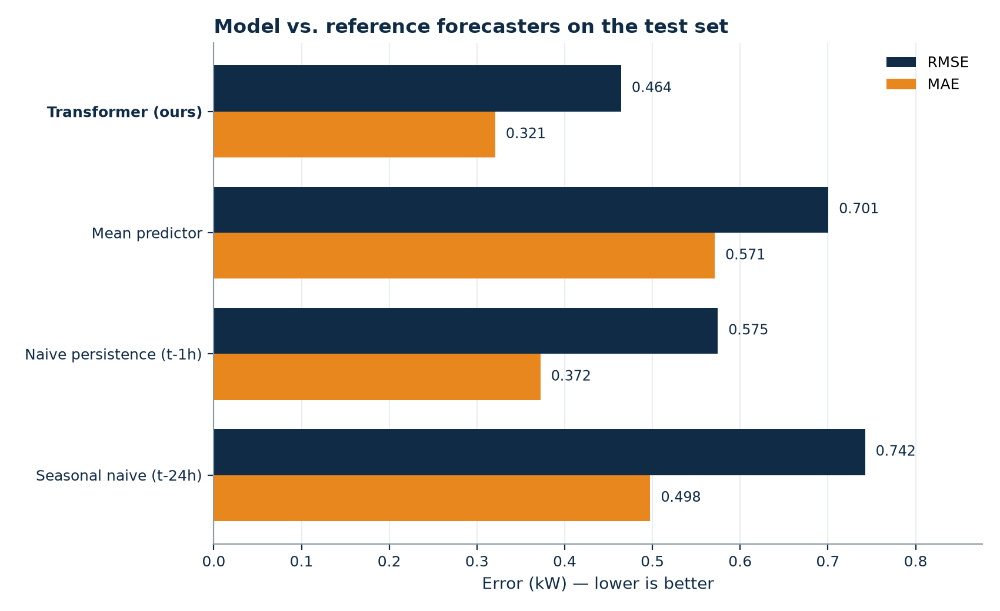
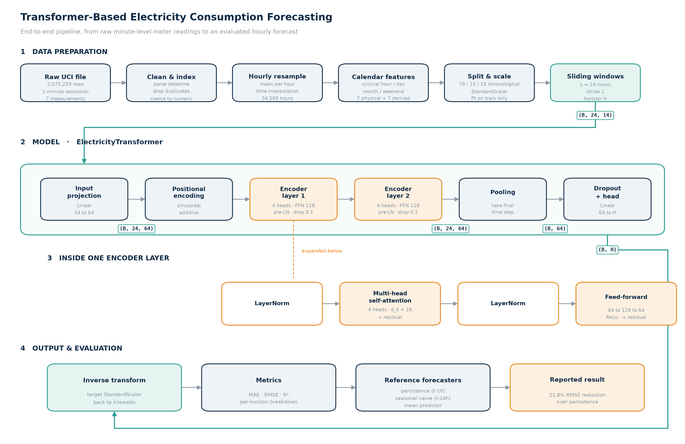

# Transformer-Based Electricity Consumption Forecasting

Multivariate time-series forecasting of household electricity demand with an
encoder-only Transformer implemented in PyTorch.

**Team:** William Peng · Ciara Cameron · Christopher Pedretti
**Course:** MSML612 — Deep Learning

---

## Result

Evaluated on 5,165 held-out hourly predictions the model never saw during training:

| Model | MAE (kW) | RMSE (kW) | R² |
|---|---|---|---|
| **Transformer (ours)** | **0.3208** | **0.4643** | **0.561** |
| Naive persistence (t−1h) | 0.3724 | 0.5745 | 0.327 |
| Mean predictor | 0.5711 | 0.7005 | 0.000 |
| Seasonal naive (t−24h) | 0.4976 | 0.7424 | −0.121 |

A **19.2% RMSE reduction over naive persistence**, the standard free forecast for
hourly load data.



---

## Architecture



Raw minute-level meter readings are cleaned, resampled to hourly means, augmented
with cyclical calendar features, split chronologically, and standardized using
statistics fit on the training split only. Sliding 24-hour windows are projected
to a 64-dimensional space, given sinusoidal positional encodings, and passed
through two pre-norm Transformer encoder layers with four attention heads. The
final time step is pooled and mapped to the forecast horizon by a linear head.

---

## Setup

### 1. Clone and install

```bash
git clone https://github.com/Ciaracam/612-Group-Project.git
cd 612-Group-Project
python -m venv .venv && source .venv/bin/activate   # Windows: .venv\Scripts\activate
pip install -r requirements.txt
```

Developed and tested on Python 3.11–3.13.

### 2. Download the dataset

The raw file is 127 MB, above GitHub's limit, so it is not committed. Download
**Individual Household Electric Power Consumption** from the UCI repository:

<https://archive.ics.uci.edu/dataset/235/individual+household+electric+power+consumption>

Unzip it and place `household_power_consumption.txt` in `data/`:

```
612-Group-Project/
└── data/
    └── household_power_consumption.txt
```

---

## Reproducing our results

Every command is run from the repository root.

### Train

```bash
python -m src.train --run-name transformer_h1
```

Writes `models/transformer_h1.pt`, the fitted scalers, and
`models/transformer_h1_history.json` (full loss history and config).

Runtime: roughly 8–12 minutes on CPU, 2–3 minutes on a CUDA GPU. Training stops
early once validation loss has not improved for 8 epochs.

### Evaluate

```bash
python -m src.evaluate --run-name transformer_h1
```

Prints the comparison table, writes `results/transformer_h1_metrics.json` and
`results/transformer_h1_predictions.csv`, and regenerates every figure in
`figures/`.

### Reproduce the figures without the dataset

```bash
python scripts/make_interim_figures.py
python scripts/make_architecture_diagram.py
```

These read the committed predictions in `models/test_predictions.csv`, so they
work on a fresh clone with no dataset and no GPU.

### Other experiments

```bash
python -m src.train --run-name transformer_h24 --horizon 24   # 24-hour-ahead
python -m src.train --run-name lstm_h1 --model lstm           # recurrent control
python -m src.ablation --group all --epochs 40                # full ablation grid
```

The ablation runner writes `results/ablation_results.{csv,md,json}`.

---

## Live demo

```bash
streamlit run demo/app.py
```

Pick any moment in the held-out test period and the app forecasts the next hour
from the preceding 24 hours, showing prediction, ground truth, and error against
the surrounding load curve. Nothing is retrained; inference is instant on CPU.

If the raw dataset is not present, the demo degrades to replay mode and shows the
committed test predictions instead of forecasting live.

---

## Repository layout

```
612-Group-Project/
├── data/                    raw dataset goes here (gitignored)
├── demo/
│   └── app.py               Streamlit live demo
├── figures/                 generated figures for the report and deck
├── models/                  checkpoints, scalers, committed test predictions
├── notebooks/
│   └── transformer_forecasting.ipynb    annotated end-to-end walkthrough
├── presentation/            final presentation deck
├── report/                  interim and final reports
├── results/                 metrics and ablation tables (generated)
├── scripts/
│   ├── make_architecture_diagram.py
│   └── make_interim_figures.py
├── src/
│   ├── data.py              loading, cleaning, features, windowing
│   ├── model.py             Transformer and LSTM control
│   ├── baselines.py         persistence, seasonal naive, mean; metrics
│   ├── train.py             training loop, early stopping, LR schedule
│   ├── evaluate.py          metrics, comparison table, figures
│   ├── ablation.py          architecture ablation grid
│   └── plots.py             shared figure styling
├── requirements.txt
└── README.md
```

---

## Reproducibility notes

- All random seeds (Python, NumPy, PyTorch, CUDA, DataLoader shuffling) are fixed
  at 42 and configurable with `--seed`.
- `StandardScaler` is fit on the training split only; validation and test are
  transformed with those statistics, so no test information leaks backwards.
- Splits are chronological, never shuffled — a shuffled split would let the model
  interpolate between neighbouring hours it has already seen.
- Sliding windows are built inside each split, so no input window spans a split
  boundary.
- Every run writes a `_history.json` recording its exact arguments, dataset
  statistics, parameter count, and per-epoch losses, so any reported number can be
  traced to the run that produced it.

---

## Dataset

Hébrail, G. & Bérard, A. (2006). *Individual Household Electric Power
Consumption* [Dataset]. UCI Machine Learning Repository.
<https://doi.org/10.24432/C58K54>

2,075,259 minute-level readings from one household in Sceaux, France, December
2006 – November 2010. Roughly 1.25% of rows carry missing values; after hourly
resampling and time interpolation the modelling set is 34,589 hours.
